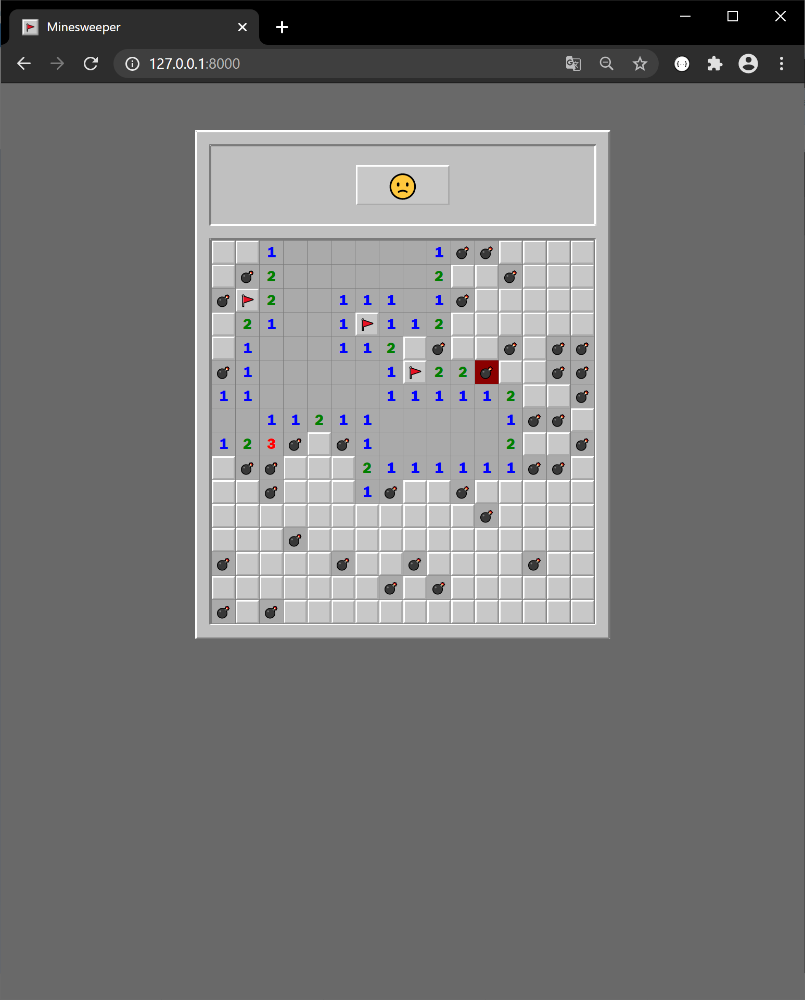

# Sea Battle

This app is my vision of the classic Minesweeper game. In this project i focused on using OOP. The emphasis was placed on the back-end, so in terms of the front-end, there are some nuances of optimization on mobile devices, which in turn don't affect the correct work of the application.

Link to Heroku application: www.md-minesweeper.herokuapp.com  

## Description

- when a player left-clicks on a cell, the game will uncover it. If there are no mines adjacent to that particular cell, 
the cell will display a blank tile, and all adjacent cells will automatically be uncovered. Right-clicking on a cell 
will flag it, causing a flag to appear on it. Note that flagged cells are still covered, and a player can click on it 
to uncover it, like a normal covered cell;

- the game includes four difficulty levels: beginner, skillful, expert and custom. There are some limits for custom
difficulty:  
  - the number of rows can't be less than 9 rows or more than 25 rows;
  - the number of columns can't be less than 9 columns or more than 50 columns;
  - the number of bombs can't be equal to 0 or exceed half of the field.
  
  If the dimension of the field is specified less than the established limits, then the size of the field will be 9 by 9. 
If the dimension of the field is specified more than the established limits, then the size of the field will be 25 by 50.
If the number of bombs is specified more than the established limits, then the number of bombs will be equal to half of the field.
If the number of bombs is specified less than the established limits, then the number of bombs will be equal to 1.
If the game parameters in custom difficulty aren't defined, then they will be set by default: the size of the field 
will be 20 by 30 with 145 bombs.

<p align="center"> </p>


## Getting Started
1. Installing virtualenv

   ```
   pip install virtualenv
   ```
2. Start a new virtual environment
   * Create
   
     ```
     unix:    virtualenv -p python3 .venv
     windows: virtualenv .venv
     ```
   * Activate
   
     ```
     unix:    source .venv/bin/activate
     windows: .venv\Scripts\activate
     ```
   * Deactivate
   
     ```
     deactivate
     ```
4. Installing packages

   ```
   pip install -r requirements.txt
   ```
5. Run Server

   ```
   python manage.py runserver
   ```

## Deploying to Heroku
0. Create account on [Heroku](https://signup.heroku.com/)  

1. Download and install the [Heroku CLI](https://devcenter.heroku.com/articles/heroku-cli)

2. Create Git repository  
   * Initialize
   
     ```
     git init
     ```
   * Add gitignore
   
     ```
     git add gitignore
     git commit -m "Add gitignore."
     ```
   * Add Minesweeper app files
   
     ```
     git add .
     git commit -m "Add minesweeper app files."
     ```
3. Log in to Heroku account and create application

   ```
   heroku login
   heroku create app-name
   ```
4. Commit changes and deploy app to Heroku using Git

   ```
   git add .
   git commit -m "Deploy."
   git push heroku master
   ```
5. Make migrations

   ```
   heroku run python manage.py migrate
   ```
6. Set environment variables

   ```
   heroku config:set DJANGO_DEBUG=""
   ```